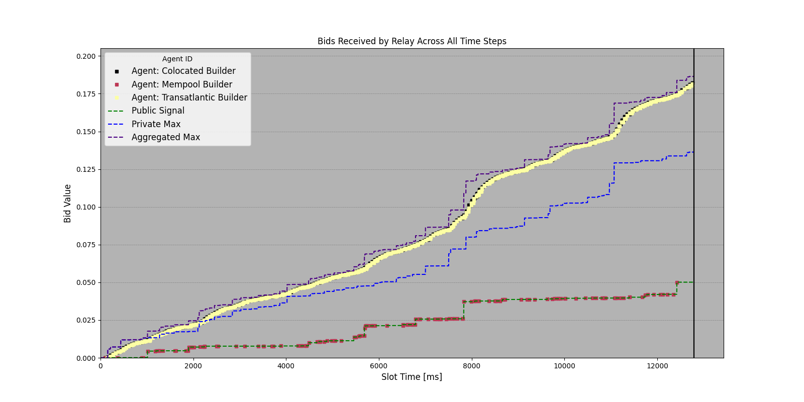

# MEV-Boost Auction Latency Simulation

This is a fork of MEV-Boost Auction Simulation Framework originally developed by [Fei](https://twitter.com/William33203632) and [Thomas](https://twitter.com/soispoke).

For expanded documentation, see [M1kuW1ll/MMASim](https://github.com/M1kuW1ll/MMASim). This repository only documents the deltas between this latency focused version of the simulation framework and the repository at the [time of the fork](https://github.com/M1kuW1ll/MMASim/commit/d1448655fb3434ae27c6eb636b0ce66cef49da66).

---

The goal of this fork is to model the advantage of a colocated block builder over a transatlantic block builder.

### Changelog

- The Naive strategy builder has been changed to an enshrined builder role. This reflects the state of local block building today; building blocks with zero profit margin but being limited to transactions in the public mempool.
- The bluffing, last minute, and stealth strategies have been removed to simplify the codebase.
- The adaptive strategy no longer bids against itself. It now bids relative to the latest top bid from a competitor agent. 
- The adaptive strategy now bids away a percentage of its profit instead of a fixed delta with a profit margin. 
    - To implement: i want the user to have the ability to do either
- Two new types of agents have been added: High Latency and Low Latency (these both leverage the AdaptiveStrategy class but are initialized with different parameters)
- For every simulation, we now calculate the expected win percentages for high and low latency builders based on the fraction of time near the end of the auction that they had the highest bid.

### Example Output

## License
This project is open-source and available under the MIT License.
